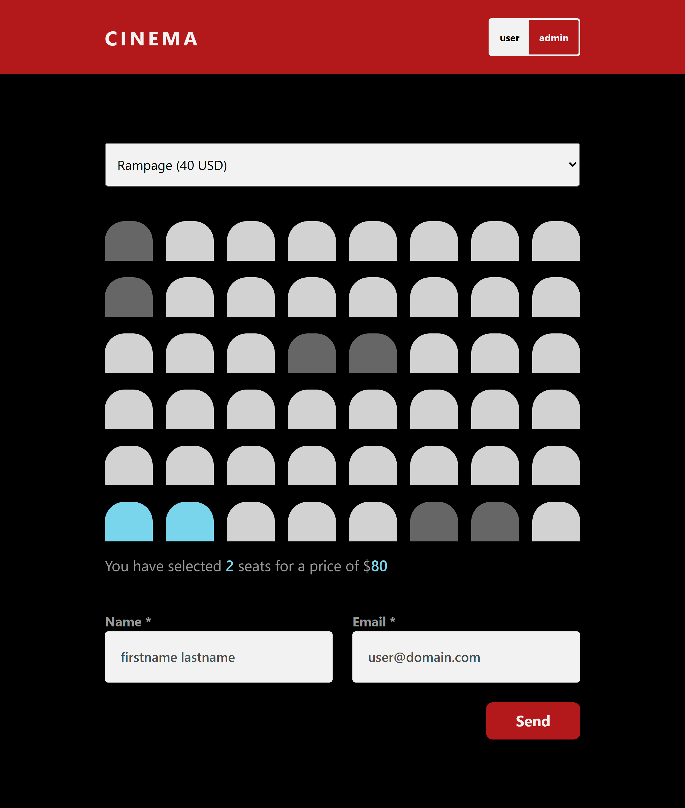

# Cinema Booking Application



This project is a full-stack cinema booking application built with React, TypeScript, and Vite. It demonstrates skills in modern web development, state management with React hooks and reducers, form validation, and RESTful API integration. The application features two modes: a user mode for browsing movies and booking seats, and an admin mode for managing the movie catalog.

The application uses React 19 with TypeScript for type safety and better developer experience. State management is handled through custom hooks with useReducer for complex state logic. The project uses json-server to simulate a REST API backend, making it easy to develop and test without a full backend setup.

CSS is organized with custom properties (CSS variables) for consistent theming across the application, including colors, spacing, typography, and component-specific styles. The design is responsive and works well on different screen sizes.

The codebase follows React best practices with custom hooks for business logic separation, proper TypeScript typing throughout, and accessibility features like ARIA labels and semantic HTML. Form validation is implemented with HTML5 validation attributes and custom validation logic.

## Project Structure

```
index.html
db.json
src/
	App.tsx
	main.tsx
	index.css
	components/
		Booking.tsx
		CrudForm.tsx
		Error.tsx
		SelectMovie.tsx
		SiteHeader.tsx
		SiteMain.tsx
	hooks/
		useBooking.ts
		useMovies.ts
	utils/
		utils.ts
```

### index.html

- The main HTML entry point for the React application.
- Contains minimal markup with a root div for React to mount.

### src/App.tsx

- The main application component that orchestrates the entire app.
- Manages the overall layout and conditional rendering based on user/admin mode.
- Integrates all child components (header, movie selection, booking, CRUD form).

### src/components/

- **Booking.tsx**: Handles the seat selection interface and booking form for users.
- **CrudForm.tsx**: Admin form for creating, updating, and deleting movies.
- **ErrorMessage.tsx**: Error message component (`ErrorMessage`) for displaying error states.
- **SelectMovie.tsx**: Dropdown selector for choosing movies and create button for admins.
- **SiteHeader.tsx**: Application header with logo and user/admin mode toggle.
- **SiteMain.tsx**: Main content wrapper component.

### src/hooks/

- **useMovies.ts**: Custom hook managing movie state, CRUD operations, and admin mode.
- **useBooking.ts**: Custom hook managing seat selection, booking state, and form submission.

### src/utils/

- **utils.ts**: Utility functions including form validation logic.

### src/index.css

- Contains all styles for the application using CSS custom properties.
- Organized with component-specific sections and utility classes.
- Responsive design with media queries for different screen sizes.

### db.json

- JSON database file used by json-server to simulate a REST API.
- Stores movies and bookings data.

## Key Features

- **Dual Mode Interface**: Toggle between user and admin modes with different capabilities.
- **Type-Safe**: Full TypeScript implementation with proper typing throughout.
- **State Management**: Complex state logic managed with useReducer for predictable updates.
- **Form Validation**: HTML5 validation with custom patterns and error messages.
- **Responsive Design**: Works seamlessly on mobile and desktop devices.
- **REST API Integration**: Full CRUD operations with json-server backend.
- **Accessibility**: ARIA labels, semantic HTML, and keyboard navigation support.
- **Modern React**: Uses React 19 features and best practices.

## Running the Application

```bash
npm ci
npm run dev
```

This starts both the json-server backend (port 3000) and Vite development server concurrently.

## User Mode Features

In user mode, visitors can browse and book movie tickets:

- Select from available movies using the dropdown menu.
- View movie details including title, price, and available seats.
- Interactive seat selection with visual feedback (available, selected, occupied).
- Real-time price calculation based on selected seats.
- Booking form with name and email validation.
- Form prevents submission until all validation rules are met.

## Admin Mode Features

In admin mode, users can manage the movie catalog:

- Toggle to admin mode using the header switch button.
- View and edit existing movies directly from the movie selector.
- Create new movies with the "Create" button.
- Update movie details: title, price, rows, and columns.
- Delete movies from the catalog.
- Form validation ensures all movie data is valid before submission.

## Booking Section

The booking interface provides an intuitive seat selection experience:

- Visual grid layout representing cinema seats.
- Color-coded seats: gray (available), cyan (selected), dark gray (occupied).
- Click to select or deselect available seats.
- Occupied seats from existing bookings are disabled.
- Selected seat count and total price displayed below the grid.
- Booking form appears when seats are selected.
- Name field accepts 2-50 letters with Swedish characters (å, ä, ö).
- Email validation with standard email pattern.
- Submit button sends booking data to the backend.

## Movie Management (Admin)

The CRUD form allows full control over the movie catalog:

- Title field with required validation.
- Price field with number input and minimum value of 1.
- Rows and columns fields to define cinema seating layout.
- Update button saves changes to existing movies.
- Delete button removes movies (persisted bookings remain).
- Create mode with separate form for adding new movies.
- Cancel button exits create mode without saving.
- All fields validated before submission to ensure data integrity.
